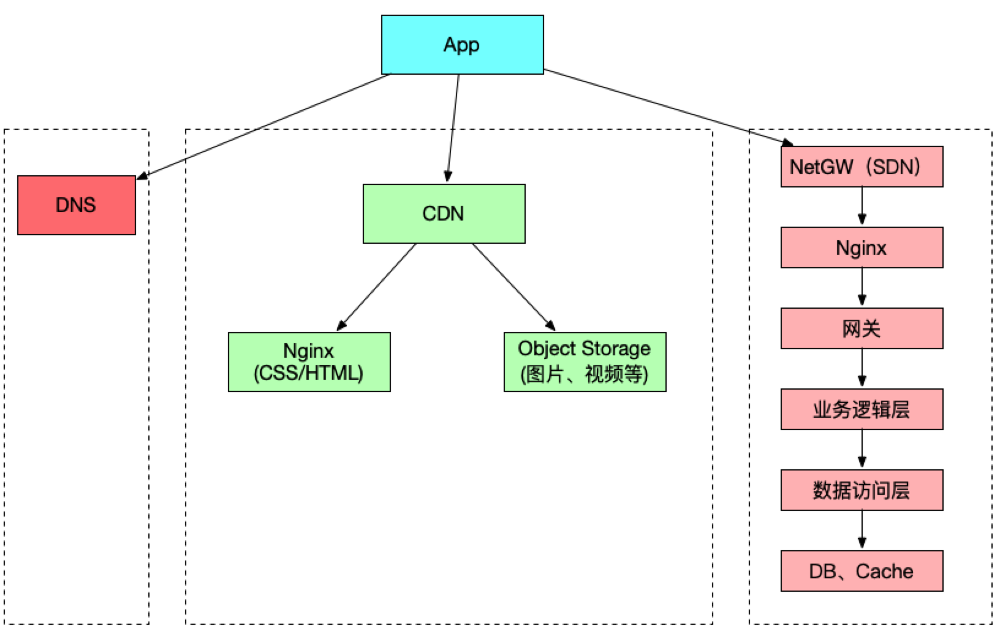
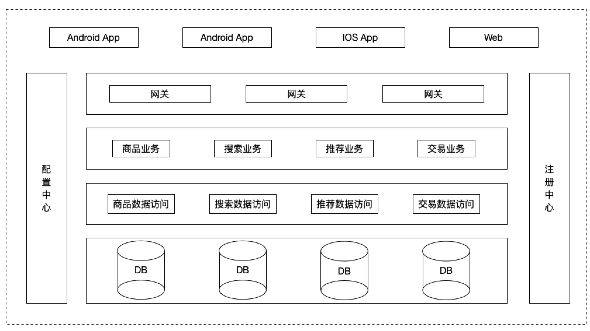

## 架构设计（一）

### 目标：

- 架构完整解决方案

  - 具体业务场景
    - 设计阶段的解决方案
    - 实际代码的解决方案
    - 线上问题的解决放哪
    - 拆分解决方案的点
  - 架构如何选型
  - 架构如何设计
  - 架构如何折中
  - 架构如何落地

- 架构后的哲学思想

  - 为什么要这么设计
  - 其他方案为啥不够优雅

  

##### 要点：快速迭代，持续交付

### 架构设计三个阶段：

- 单体阶段
- 微服务阶段
- 服务网格

### 水平分层架构：

##### 设计原则：

- 网关层
  - 1. 请求鉴权
    2. 数据完整性验证
       1. 数据包定长Header和变长Body
    3. 协议转换
       1. Https -> 网关 -> TCP - protobuf -> 业务1 - protobuf -> 业务2 -> SQL97 -> 数据库
    4. 路由转发
       1. 根据Header中的cmd转发到不同业务逻辑层
    5. 服务治理
       1. 限流、熔断、降级等
- 业务逻辑层
- 数据访问层
  - 1. CRUD
    2. ORM（MyBatis）
    3. Sharding（Sharding-JDBC）
       1. RDBMS
       2. NoSQL
       3. NewSQL（TiDB：单库存储理论上无上限：千亿数据量查询4毫秒）
          1. 参考：转转公司对TiDB的实践
    4. 屏蔽底层存储差异
       1. MySQL、MongoDB、Redis等

##### 同步架构&异步架构

任何两层之间添加一个第三层（MQ）就可以变成异步架构

问：为什么加了一层MQ，速度就会变快？

答：MQ写磁盘顺序写append，写DB 99%是随机写

##### 分层：

- 四层同步架构（网关层、业务逻辑层、数据访问层、数据存储层）

- 五层异步架构（网关层、异步消息队列层、业务逻辑层、数据访问层、数据存储层）

##### 异步架构

- 目的：提高吞吐量

- 手段：增加消息队列

- 场景：
  - 请求类型
    - 读：不适用
    - 写：
      - 强一致性：不适用（支付）
      - 弱一致性：适用（社交消息）
  - 业务类型
    - 异步写后，用户离开读，出现未读到的场景（微信缓存朋友消息，一段时间后如果失败了，则提示用户）

##### 同步架构

Object Storage：

- 对象存储 FastDFS 、 Ceph

### SOA：面向服务架构

> 特点：垂直架构

按照业务进行拆分，每个服务就是一个单体，包含其业务预的全部逻辑

### 微服务架构

> 特点：垂直+水平架构

### Service Mesh

配置中心：Apollo

数据一致性：最终一致性

