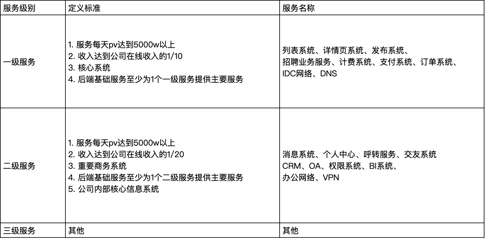
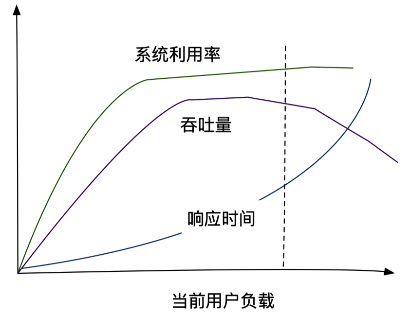
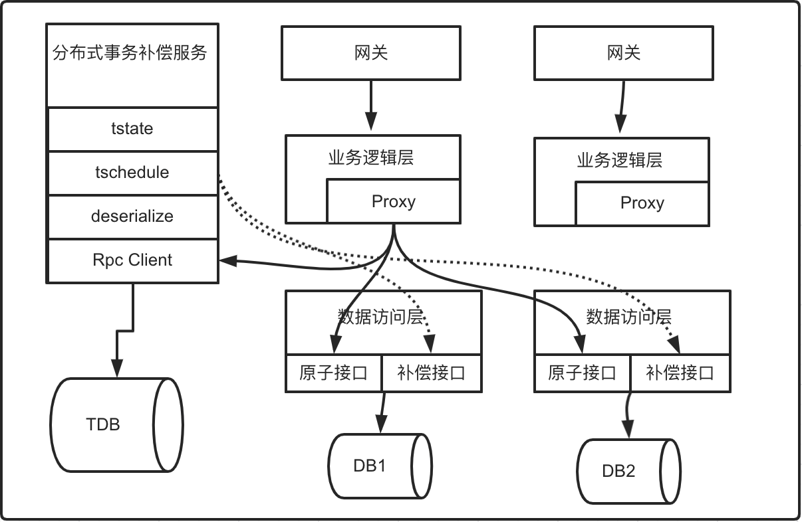

## 架构设计（二）

### 高可用

- 衡量标准：

  - 传统：2个9、3个9（可用百分比为99.9%，按一年算不可用时间为：(1-99.9%) * 365*24 = 8.76小时）、4个9、5个9等
  - 合理：不可用请求量占全年请求量的百分比

- 手段：

  - 服务冗余
  - 无状态话（动态扩容）
  - 负载均衡（识别异常节点，自动路由到其他节点）
  - 幂等设计
  - 超时机制
  - 异步化设计
  - 服务限流降级熔断
  - 数据复制、缓存、Sharding
  - 架构拆分、服务治理

- 监控

  - 日志上报，flume收集到kafka，由Spark实时计算统计，窗口5分钟

- 服务分级（降低或者避免服务出现故障）

   

  

### 高并发

- 衡量指标

  - 吞吐量（Throughput）
  - 响应延迟（Response Delay）

- 优化手段

  - 缩短响应时间
  - 提高并发数（增加吞吐量）
  - 让系统处理合理状态

  

  - 空间换时间（缓存）
  - 时间换空间（压缩数据，占用cpu解包时间）
  - 找到系统瓶颈（核心链路关注+优化）
  - 调用多少RPC接口，载入多少数据量，使用什么算法，**非核心流程能否异步化**，没有数据依赖的逻辑能否并行执行

**MySQL查询数据量大于数据的30%时，会忽略索引转而走全表扫描**

##### 服务熔断

- 网关层rpc请求结果统计计数，到达一定错误占比，触发熔断，关闭与某个节点的连接池，发送控制信息给到控制中心
- 控制中心接受到信息给对应服务节点的Agent发送控制命令
- Agent接受到命令后：
  - jstack两到三次
  - 发送kill命令（优雅关闭：kill -2   kill -4 等信号量，由业务程序捕获处理）
  - 关闭服务后，sleep注册中心心跳检测的时间间隔的2到3倍时间，注册中心将该节点移除列表，网关监听到后，停止路由到该节点
  - 重启服务，注册中心注册恢复正常

##### 幂等设计

- 场景
  - CRUD：只有R（read）是绝对幂等的，其他都存在不幂等的情况
  - 涉及到分布式的CRUD
  - 消息的重复消费
  - 订单的重复创建（用户维度加锁，页面网络抖动重复请求）

- DB自增主键

  - 一定程度上可以解决一些幂等问题
  - 问题：
    - 主从DB存在复制延迟，数据不一致，发生主备切换时存在问题
    - 自增主键在业务上不能规避重复问题

- 业务主键|分布式唯一ID

- 分布式锁：

  - Redis实现（AP）：setNX，Lua脚本
    - 单机Redis：
      - Redis挂掉，彻底阻塞业务流程
      - t1拿到锁，Redis挂掉重启，数据丢失，t2也拿到锁
    - 主从Redis：
      - t1拿到锁，主节点挂掉，数据并未同步给从节点，主备切换，t2在新的主节点拿到锁
    - 无法续期（开源Redisson有方案）
      - 锁的租期内未完成业务逻辑处理
    - 官方建议：红锁算法，实现一致性协议，需要三个主从redis来实现，非常复杂
  - CP：
    - Zookeeper：ZAB
    - Etcd：raft（TiDB底层也是用他）
    - Jraft：蚂蚁金服
  - **设计目标：**
    - 强一致性
    - 服务高可用，系统稳健
    - 锁自动续约及其自动释放
    - 代码高度抽象，业务接入极简
    - 可视化管理后台，监控及管理
  - 对比：

  |            | redis  | zookeeper                   | etcd        |
  | ---------- | ------ | --------------------------- | ----------- |
  | 一致性算法 | 无     | paxos/ZAB                   | raft        |
  | CAP        | AP     | CP                          | CP/AP       |
  | 高可用     | 主从   | N+1可用                     | N+1可用     |
  | 接口类型   | 客户端 | 客户端                      | http/grpc   |
  | 实现       | setNx  | createEphemeral创建零时节点 | Restful API |
  | 持久化     | 无     | 有                          | 有          |

  - 选择Etcd
    - 分布式Client+etcd
      - Client+TTL模式：续期实现：客户端在与etcd进行心跳过程中，如果锁还没有释放掉，则续期
        - etcd存在内容包括：key, ttl, value, uuid（锁的唯一凭证）
        - key的**三分之一过期时间**作为心跳时间，心跳线程负责拿到key后，**CAS**唯一凭证uuid进行续期
        - 释放锁
    - Etcd的分布式是使用CAS实现的
      - prevValue：校验value值为唯一判断
      - prevIndex：基于etcd返回的index进行唯一判断
      - prevExist：校验key，prevExist=true为更新请求，prevExist=false为创建请求
  - 设计：
    - 业务方申请资源锁，调用时提供key，ttl
    - etcd生成uuid，作为当前的锁的唯一凭证，将 key，uuid，ttl写入etcd
    - 检查etcd中此key是否存在，如果没有，则尝试写入key，写入失败，则拿锁失败，写入成功，则拿锁成功
    - 拿锁后，心跳线程启动，心跳线程维持时间为ttl/3，compare and swap uuid 从而将key值续租
    - API：**(TODO 实现SDK)**
      - 申请锁：
        - curl http://127.0.0.1:2379/v2/keys/foo -XPUT -d value=bar -d ttl=5 prevExist=false
      - CAS更新锁续租
        - curl http://127.0.0.1:2379/v2/keys/foo?prevValue=bar -XPUT -d ttl=5 -d refresh=true -d prevExist=true
      - CAS删除锁：
        - curl http://127.0.0.1:2379/v2/keys/foo?prevValue=bar -XDELETE
    - 获取锁失败，则提示false给SDK
    - **解锁：调用方必须手动解锁，如果业务方异常了，可以考虑续期动作只支持最多三次？？？**
  - 监控：
    - 锁的平均耗时监控
  - **V3版本，支持Grpc，不需要自己起线程进行自动续期**

##### 分布式事务

- 异步场景
  - 方案一：
    - 两阶段提交：先提交半消息给MQ（定制MQ），成功后在提交本地事务，本地事务提交成功、失败后，提交MQ，MQ决定提交还是删除半消息；当半消息在一定时间内未收到commit或rollback事件，则需调用业务方提供的本地事务查询回调接口校验事务状态（侵入业务） - RocketMQ
    - 本地事务消息表：订单表+本地事务消息表在同一DB实例上，使用本地事务同时提交订单和该订单的事务消息到DB，成功后，向MQ发送消息，修改本地事务表的状态，控制重复消费和失败重试等逻辑
- 同步场景
  - 方案：
    - 基于异步补偿的分布式事务（向前补偿 - 其实就是回滚）
    - 1. 记录请求调用链路
      2. 基于补偿机制
      3. 提供幂等补偿接口
  - 实践：
    - 业务逻辑层Proxy设计（Aop代理）
      - 自定义分布式事务注解，环绕Aop代理
      - Proxy在执行业务逻辑之前，生成全局唯一TXID标识**事务组**，TXID保存在ThreadLocal中，方法开始前写入ThreadLocal，方法结束后清除；向远程TDB写入事务组并标识事务状态为开始
      - 业务逻辑调用数据访问之前，通过RPCProxy代理记录当前请求参数，如果远程业务调用正常，则当前调用参数（调用接口方法名，参数）记录存档到事务组表关联的事务调用记录表；如果所有调用链路都正常结束，则标记该事务组状态为成功；如果远程业务调用异常，则Proxy标记该事务组状态为失败，由分布式事务补偿服务调度（5s一次），进行向前补偿，回滚调用业务提供的补偿接口
      - 补充方式绑定到原子接口：使用注解+扫描+配置中心进行定位绑定
      - 事务组表：txid，state，timestamp
      - 事务调用组表：txid，acitonId（执行步骤，由ThreadLocal调用计数），callMethod（调用方法名），paramatype（服务类型：web服务，RPC服务），params（参数）

##### 服务降级

目标：保证核心服务可用，非核心服务弱可用，甚至不可用

- 服务层降级
- 数据层降级
- 柔性可用策略（自动）

手段：

- 拒绝部分请求
- 关闭部分服务（业务相关的 - 退货 - 退款）

